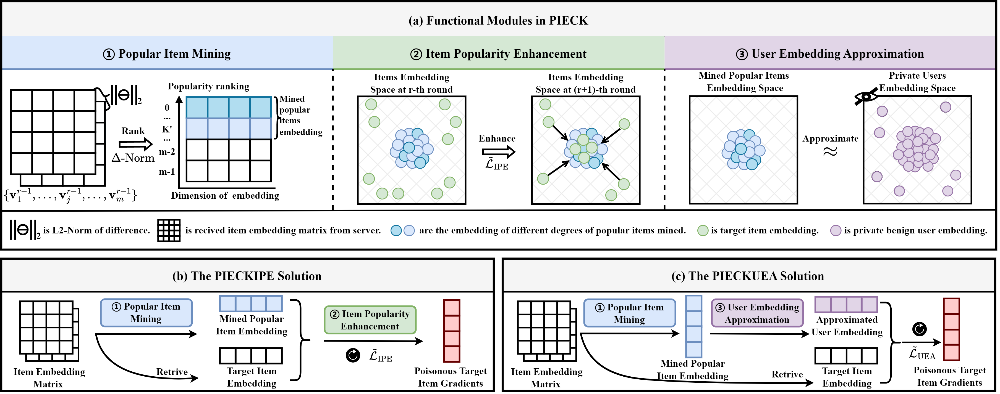

# PIECK
Preventing the Popular Item Embedding Based Attack in Federated Recommendations

## Requirements

- PyTorch
- NumPy

## Files
### MF-FRS/DL-FRS
- parese.py: Hyperparameter setting for PIECK.
- attack.py: malicious users
- client.py: benign users & benign users with defense
- server.py: server aggregation and defense
- defense.py: federated defenses
- data.py: data process
- evaluate.py: ER@K & HR@K
- main: Core code for PIECK, Logic, and interaction throughout the pipeline.

## Usage

1. Download ML-100K, ML-1M, and AZ datasets or Execute the program default download; 
2. Set parameters in parese.py;
3. Execute main.py to run the PIECK.
